# DevOps SteamScraper

[](https://github.com/tem3lkov/steam-scraper-devops/actions/workflows/ci.yml)
[](https://github.com/tem3lkov/steam-scraper-devops/actions/workflows/cd.yml)


A tiny **Python + FastAPI** service created to demonstrate DevOps practices for the *Modern Practices in DevOps* course at FMI.  
The code is intentionally lightweight — the interesting parts are the **pipeline**, **containers**, **Kubernetes deployment**, and **security checks**.

---

## 🚀 Pipeline Visualization

```mermaid
flowchart LR
  subgraph TRIG["Triggers (push + PR)"]
    direction TB
    T1["push → feature/**"]
    T2["push → dev"]
    T3["PR: feature/* → dev"]
    T4["PR: dev → main (required)"]
  end

  subgraph CI["CI workflow (GitHub Actions)"]
    direction TB
    Q["Quality Gate<br/>(lint • format • tests)"]
    SEC["Container Security<br/>(build runtime + Trivy)"]
    SAST["SAST<br/>(CodeQL)"]
    Q --> SEC
  end

  T1 --> CI
  T2 --> CI
  T3 --> CI
  T4 --> CI

  CI --> PASS{"Required checks<br/>are green?"}
  PASS -->|yes| DEV["dev updated / merged"]
  DEV -->|"PR only"| MAIN["main merged"]

  subgraph CD["CD (main only)"]
    direction TB
    MAIN --> PUB["Publish image to GHCR<br/>(tags: sha + latest)"]
    PUB --> KIND["Deploy to Kubernetes<br/>(kind on GitHub runner)"]
    KIND --> ROLL["Rollout check<br/>(kubectl rollout status)"]
    ROLL --> SMOKE["Smoke tests<br/>(/health • /games)"]
  end

  classDef box fill:#0b1220,stroke:#334155,color:#e5e7eb,stroke-width:1px,rx:10,ry:10;
  classDef sec fill:#0b1220,stroke:#fb7185,color:#ffe4e6,stroke-width:2px,rx:10,ry:10;
  classDef dep fill:#0b1220,stroke:#34d399,color:#dcfce7,stroke-width:2px,rx:10,ry:10;
  classDef gate fill:#111827,stroke:#fbbf24,color:#fef3c7,stroke-width:2px,rx:12,ry:12;

  class T1,T2,T3,T4,CI,Q,PASS,DEV,MAIN box;
  class SEC,SAST sec;
  class PUB,KIND,ROLL,SMOKE dep;

  linkStyle default stroke:#94a3b8,stroke-width:1.5px;
```



---

## 🎯 What is this repo about?

This repo is primarily about the delivery process (CI/CD), not complex business logic. It demonstrates how to:

* **Build & test** a FastAPI service
* **Package** it with a multi-stage **Dockerfile**
* **Scan** code and containers for security issues (**CodeQL** + **Trivy**)
* **Publish** images to **GitHub Container Registry (GHCR)**
* **Deploy** automatically to **Kubernetes** (a fresh **kind** cluster on a GitHub runner)
* Validate deployments with **smoke tests** against real endpoints

---

## 🌿 Branching Strategy

`feature/*` → PR into **`dev`** (CI required) → PR into **`main`** (CI required + triggers CD) → automatic deploy.

`main` is protected; merges require green CI (no direct pushes).

---

## ⚡ API Overview

| Method | Path            | Purpose                           |
| ------ | --------------- | --------------------------------- |
| GET    | `/health`       | Used by probes & smoke tests      |
| GET    | `/games?rows=N` | Returns **N** Steam games as JSON |

---

## 🛠 Stack

* **Python 3.12**, **FastAPI**, **Uvicorn**
* Tests → `pytest`
* Lint → `flake8`, format → `black` (check mode)
* **Docker** multi-stage build → slim runtime image
* Registry → **GHCR**
* **Kubernetes** → `kind`
* **GitHub Actions** → `.github/workflows/ci.yml` & `cd.yml`
* Security → **CodeQL** (Python SAST) + **Trivy** (image scan)

---

## 📂 Repo Tour

```text
.
├─ backend/
│  ├─ api.py               # FastAPI app (/health, /games)
│  └─ scraper.py           # Minimal scraping / parsing logic
├─ tests/                  # pytest suites
├─ k8s/                    # Kubernetes YAML
│  ├─ namespace.yaml
│  ├─ deployment.yaml
│  └─ service.yaml
├─ .github/workflows/      # CI / CD pipelines
│  ├─ ci.yml
│  └─ cd.yml
├─ requirements.txt
├─ Dockerfile              # multi-stage
└─ README.md
```

---

## 💻 Quick Local Run (No Docker)

```bash
python3 -m venv .venv
source .venv/bin/activate
pip install -r requirements.txt

pytest -q
uvicorn backend.api:app --host 0.0.0.0 --port 8000

curl http://localhost:8000/health
curl "http://localhost:8000/games?rows=3"
```

---

## 🐳 Docker (Multi-stage)

```bash
docker build --target runtime -t steamscraper-backend:local .
docker run --rm -p 8000:8000 steamscraper-backend:local

curl http://localhost:8000/health
```

---

## ☸️ Kubernetes (Local)

```bash
kind create cluster --name steamscraper

kubectl apply -f k8s/namespace.yaml
kubectl apply -f k8s/deployment.yaml
kubectl apply -f k8s/service.yaml

kubectl rollout status deploy/steamscraper-backend -n steamscraper

kubectl port-forward svc/steamscraper-backend -n steamscraper 8000:80
curl http://localhost:8000/health
```

---

## 🔄 CI Overview (`ci.yml`)

CI runs on pushes to `feature/**`, `dev`, and on PRs to `dev`/`main`.

### Jobs

* **quality-gate**

  * `flake8` lint
  * `black --check` format validation
  * `pytest` unit tests

* **container-security-scan** (runs after `quality-gate`)

  * builds the **runtime** Docker image
  * scans the image with **Trivy**
  * fails on `HIGH` / `CRITICAL` vulnerabilities

* **sast-codeql**

  * GitHub **CodeQL** static analysis (Python)
  * results appear under **Security → Code scanning**

---

## 🚀 CD Overview (`cd.yml`)

CD runs only on `main` (and `workflow_dispatch` for demos).

### Jobs

* **publish-image**

  * builds the Docker image
  * pushes to GHCR with tags:

    * `ghcr.io/<owner>/steamscraper-backend:<sha>`
    * `ghcr.io/<owner>/steamscraper-backend:latest`

* **deploy-kind**

  * creates a fresh **kind** cluster on the GitHub runner
  * applies Kubernetes manifests
  * updates the deployment with `kubectl set image` (no manifest editing)
  * waits for rollout, then runs smoke tests:

    * `/health`
    * `/games?rows=1`
  * on failure, prints pods, events and recent logs for debugging

---

## 🛡️ Security Measures

* **CodeQL (SAST)** — Python static analysis (Security → Code scanning)
* **Trivy** — scans the built Docker image in CI and fails the pipeline on `HIGH`/`CRITICAL`
* **Branch Protection** — `main` requires PR + passing checks, no force-push

---

## ✅ DevOps Topics Covered

- **Source Control & Branching Strategy**: Feature branches → Dev → Main flow with protected branches and PR reviews.
- **Collaboration**: Code reviews enforced via Pull Requests.
- **CI (Continuous Integration)**: Automated Linting (flake8), Formatting (black), and Testing (pytest).
- **CD (Continuous Delivery)**: Automated pipelines for building, tagging, and deploying to Kubernetes.
- **Artifact Management**: Versioned Docker images stored in GitHub Container Registry (GHCR).
- **Docker**: Optimized Multi-stage builds for smaller, more secure images.
- **Kubernetes Orchestration**:
  - **High Availability**: Running multiple replicas to ensure uptime.
  - **Self-healing**: Liveness & Readiness probes for automatic recovery.
  - **Zero-downtime Deployment**: Rolling updates strategy.
- **Security (DevSecOps)**:
  - **SAST**: Static Application Security Testing with GitHub CodeQL.
  - **Container Security**: Vulnerability scanning with Trivy (blocking critical CVEs).
- **Infrastructure as Code (IaC)**: Pipelines and Kubernetes manifests defined in code.
- **Public Cloud Services**: Leveraging GitHub Actions runners and Cloud Registry.

---

## 🔮 Roadmap Ideas

* Real Steam API calls & caching (Redis)
* DB + migrations (PostgreSQL + Alembic)
* Basic front-end client with its own pipeline
